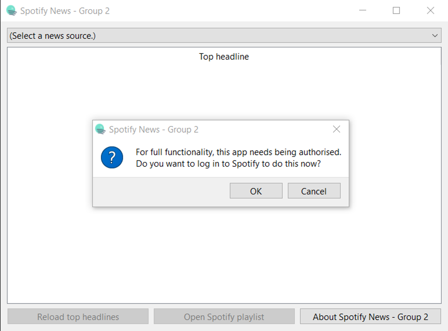
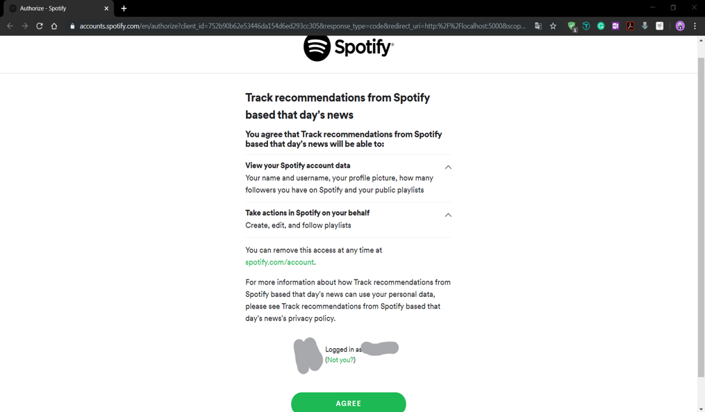
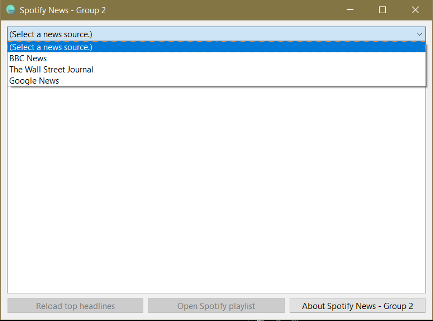
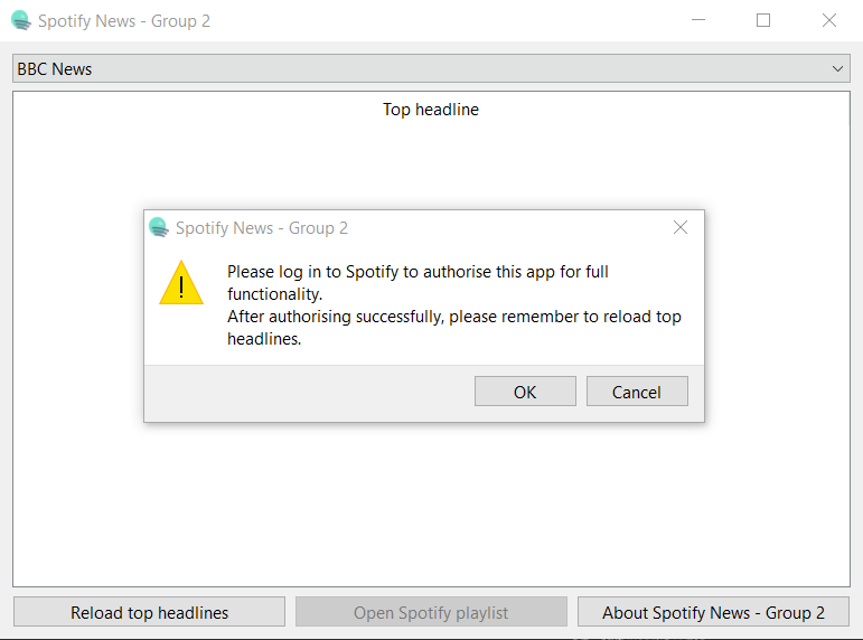
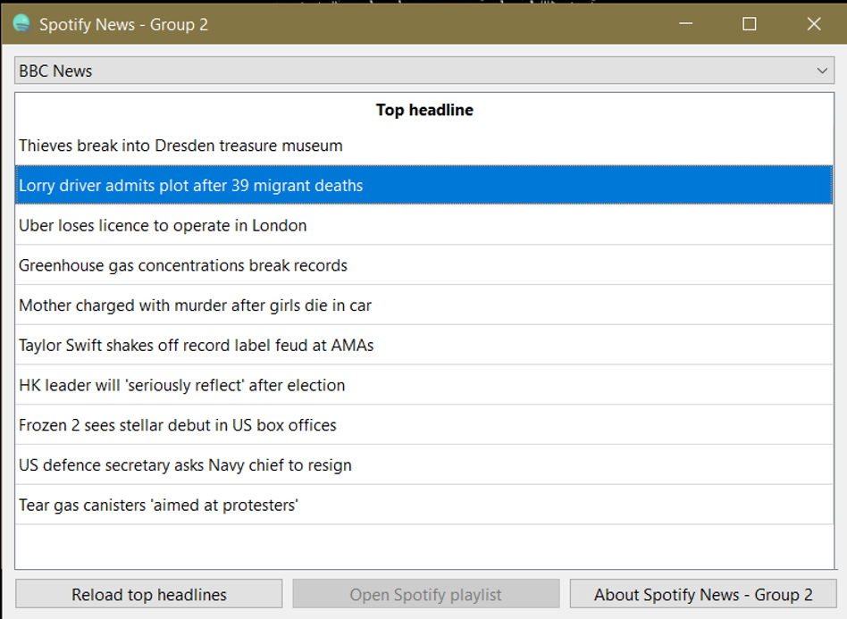
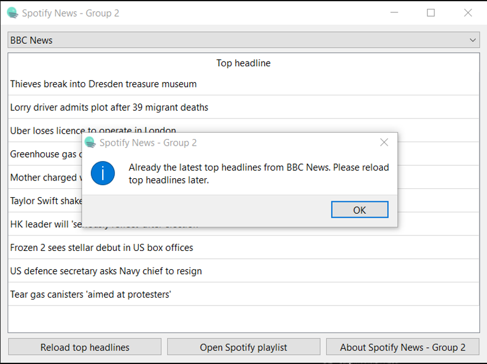
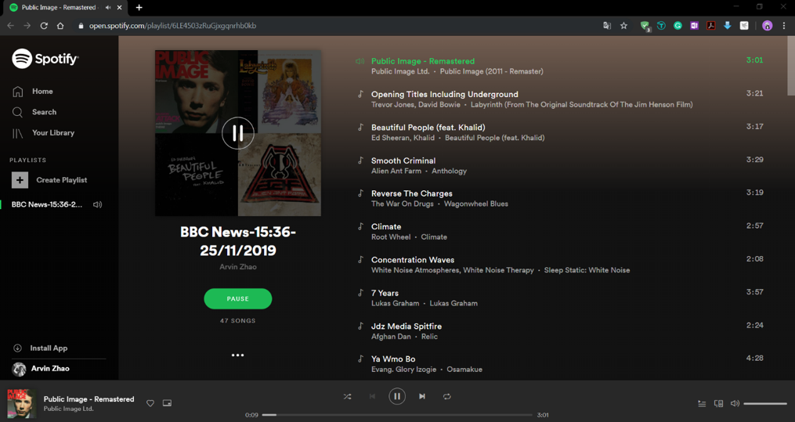
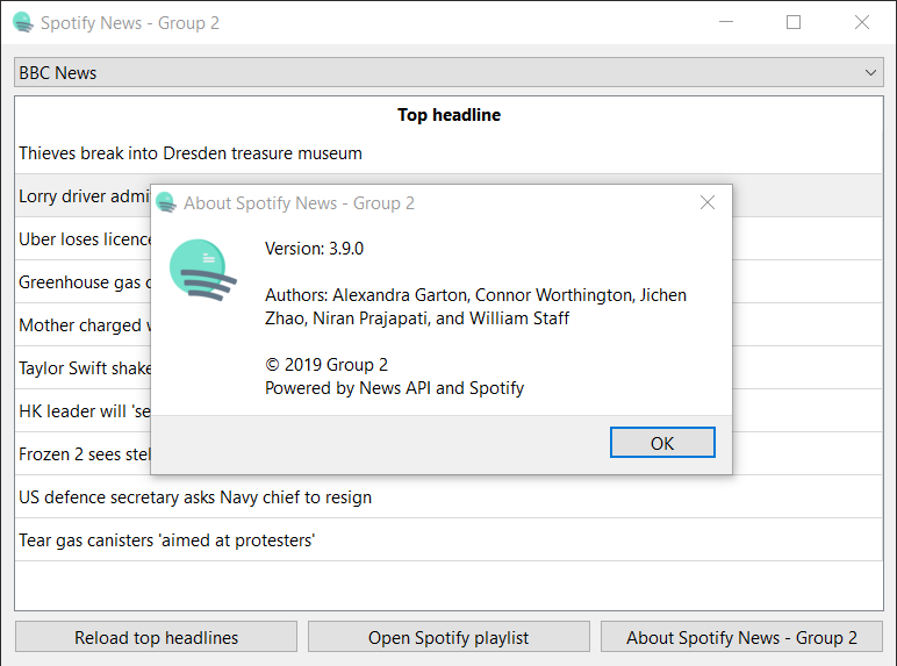

# SpotifyNews From the Project UoL_Y3S1_SE

In the `master` branch, this project is named as **Spotify News** which can generate track recommendations from Spotify based on keywords extracted from that day's news pulled from [News API](https://newsapi.org/). It is developed by **Team 2** as Assessment 1 of the course **Software Engineering** during Semester 1 of Year 3 in UoL. It must be admitted that there are many things to optimise, such as the log format and the performance. However, since the major aim of the assessment is to better understand the Agile methodology SCRUM and to produce standard documentation, it does not really matter whether the application is perfect or not.

## About Team 2

Team members are **Niran Prajapati** (SCRUM Master), **Alexandra Garton**, **Connor Worthington**, **Jichen Zhao**, and **William Staff**.

## Partial UI

Figure 1
Figure 2
Figure 3
Figure 4
Figure 5
Figure 6
Figure 7
Figure 8
Figure 9

## ATTENTION

1. You can type the command `pip install -r requirements.txt` into the command prompt under the root directory of the project to simplify the pip installation.
2. The project uses [Qt for Python](https://www.qt.io/qt-for-python) to build the UI framework. The command `pyside2-uic -x appMainWindow.ui -o appMainWindow.py` was used to convert the UI file to a PY file.

For more info on the project, turn to the relevant report.